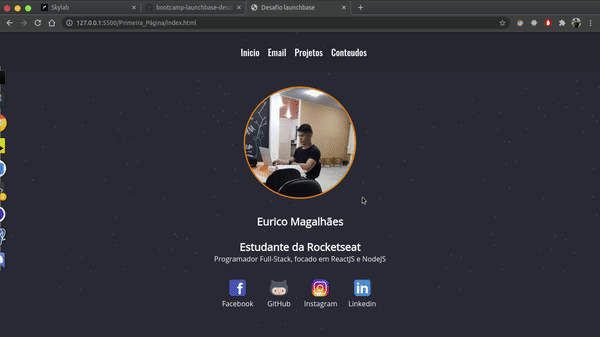

<h1 align="center">
    
</h1>

<h3 align="center">
  Desafios Módulo 2 - Iniciando no front-end
</h3>

## 📎 Módulo 1

 Neste módulo foi abordado a construção do front-end de uma página, incluindo:  
- HTML; 
- CSS; 
- Manipulação da DOM com JS; 

## 💻 Resultado:

## 📋 Licença

Esse projeto está sob a licença MIT. Veja o arquivo [LICENSE](../LICENSE) para mais detalhes.

#### 🙋‍♂️ Feito por EURICO MAGALHÃES - [Entre em contato!](https://www.linkedin.com/in/eurico-magalh%C3%A3es/)
